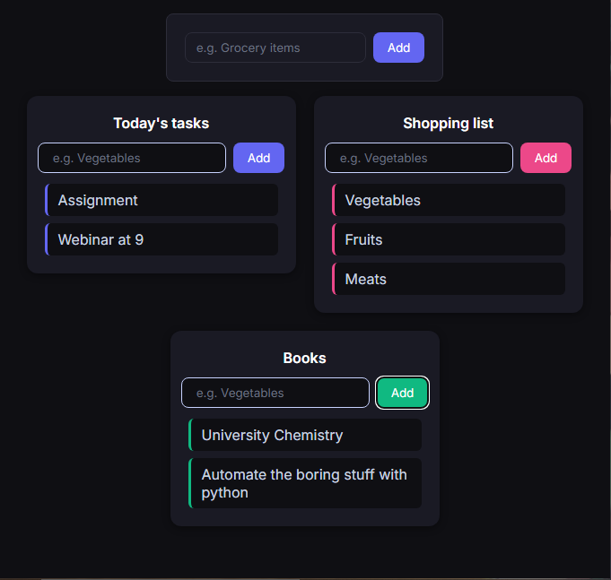

# Multi List Organizer 📋

Create multiple lists, add items to each — all in a dark, color-coded UI.

## Live Demo
🔗 [multi-list-organizer.vercel.app](https://multi-list-organizer.vercel.app)

---

## Preview





---

## Features

- 🗂️ Create as many lists as you need
- ✏️ Add items to each list independently
- 🎨 Each card gets its own accent color
- 🌙 Dark mode UI

---

## Built With

<table>
  <tr>
    <td align="center" width="80">
      
      <br><sub>React</sub>
    </td>
    <td align="center" width="80">
      
      <br><sub>Vite</sub>
    </td>
    <td align="center" width="80">
      
      <br><sub>JavaScript</sub>
    </td>
    <td align="center" width="80">
      
      <br><sub>CSS3</sub>
    </td>
  </tr>
</table>

---

## Run Locally

```bash
git clone https://github.com/Aashutosh-kc/multi-list-organizer.git
cd multi-list-organizer
npm install
npm run dev
```
Built as part of my frontend development journey.
